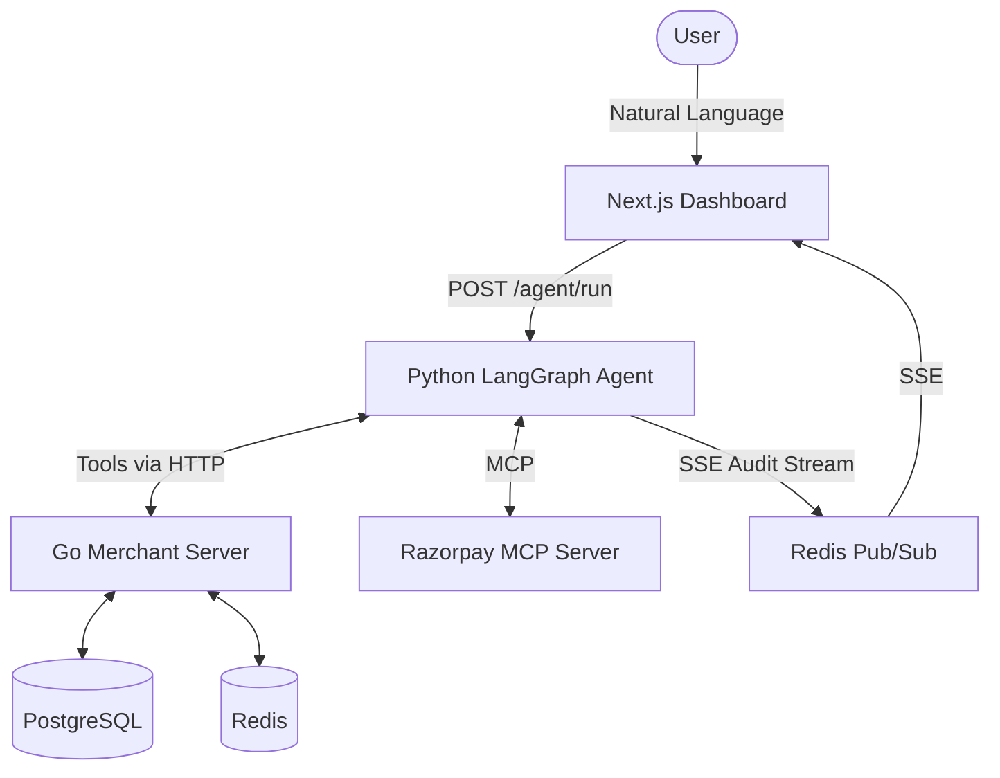

# PayAgent — Autonomous AI Shopping Assistant

> An AI agent that shops for you. Search → Cart → Pay — fully autonomous with human-in-the-loop safety.


## What It Does
PayAgent is an autonomous shopping assistant that accepts natural language goals (e.g., "Buy running shoes under ₹2000"). It uses LangGraph to independently query a product catalog, build a shopping cart, and present a Razorpay checkout session to the user, strictly adhering to predefined spending guardrails.

## Architecture


## Features
- **Autonomous AI shopping agent** (LangGraph + Groq Llama 3)
- **Spending guardrails** with configurable limits to auto-reject expensive carts
- **Human-in-the-loop** payment approval before final checkout
- **Real-time audit trail** via SSE (Server-Sent Events) and Redis Pub/Sub
- **Razorpay payment integration** via official MCP (Model Context Protocol) Server
- **Voice input support** using Web Speech API
- **Analytics dashboard** for session and order tracking
- **Multi-turn conversations** to tweak cart contents interactively
- **Error recovery** with exponential backoff and retry logic
- **Real-time token cost tracking**

## Quick Start

### 1. Start Database & Redis
```bash
docker compose up -d postgres redis
```

### 2. Start Go Merchant Server
```bash
cd merchant-server
cp .env.example .env
go run cmd/server/main.go
```

### 3. Start Python AI Agent
```bash
cd ai-agent
python3 -m venv venv
source venv/bin/activate
pip install -r requirements.txt
cp .env.example .env # Add GROQ_API_KEY
python3 -m uvicorn main:app --port 8001
```

### 4. Start Next.js Dashboard
```bash
cd dashboard
npm install
npm run dev
```
Navigate to [http://localhost:3000](http://localhost:3000)

## Demo Scenarios
Try these queries on the dashboard:
1. `Buy running shoes under ₹2500`
2. `Find wireless earbuds under ₹1500`
3. `I need a laptop bag for college`
4. `Get me a book on system design`
5. `Buy a smartwatch under ₹2000`

## Tech Stack
| Component | Technology | Description |
|-----------|------------|-------------|
| **Frontend** | Next.js 14, React, Recharts | Sleek dark-mode dashboard with SSE, voice input, and charts. |
| **Backend API** | Go (Gin) | Blazing fast merchant API managing catalog, cart, and orders. |
| **AI Agent** | Python, FastAPI, LangGraph | State machine managing tool execution and logic. |
| **Database** | PostgreSQL, Redis | Persistent storage and pub/sub event bus. |
| **LLM / Tooling**| Groq, MCP | Low-latency inference and standard Razorpay integration. |

## Project Structure
```
payagent-core/
├── ai-agent/          # Python LangGraph logic
├── dashboard/         # Next.js UI
├── db-init/           # SQL seeds
├── merchant-server/   # Go REST APIs
└── docker-compose.yml
```

## License
MIT
